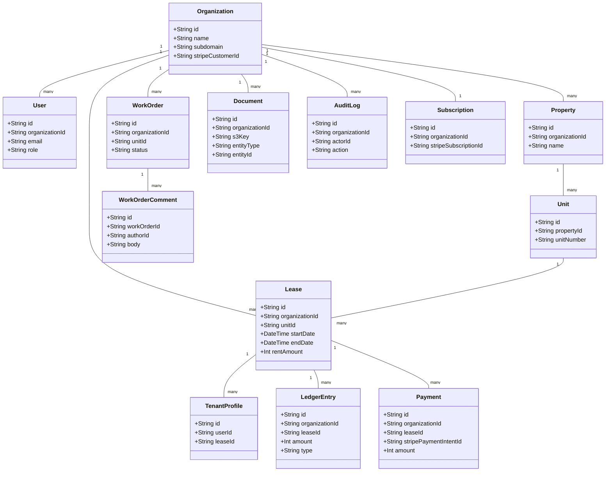
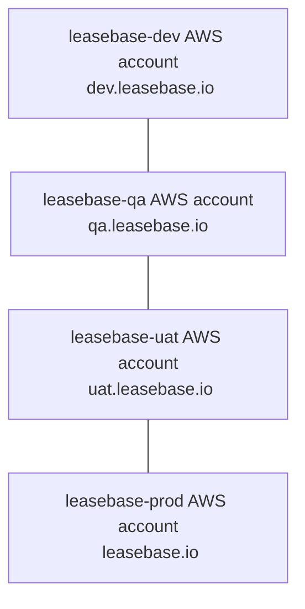

# Leasebase Architecture

Leasebase is a multi-tenant, cloud-native property management SaaS. It is implemented as a TypeScript monorepo with web, mobile, API, and infrastructure code.

## High-level system architecture

```mermaid
flowchart LR
  subgraph Clients
    Web[Web App (Next.js)]
    Mobile[Mobile App (React Native / Expo)]
  end

  subgraph AWS[Leasebase AWS Account]
    CF[CloudFront]
    ALB[Application Load Balancer]
    ECS_API[ECS Fargate Service - API]
    ECS_WEB[ECS Fargate Service - Web]
    RDS[(RDS PostgreSQL)]
    S3[(S3 Buckets)]
    Cognito[Cognito User Pool]
    SES[SES]
    CW[CloudWatch Logs/Metrics]
  end

  Clients --> CF --> ALB
  ALB --> ECS_WEB
  ALB --> ECS_API
  ECS_API --> RDS
  ECS_API --> S3
  ECS_API --> SES
  Web --> Cognito
  Mobile --> Cognito
  ECS_API --> Cognito
  ECS_API --> CW
```

Each environment (dev, qa, uat, prod) is deployed into its own AWS account with its own VPC, ECS cluster, RDS instance, S3 buckets, Cognito user pool, and supporting resources. There are **no cross-account runtime dependencies**.

## Monorepo layout

- `apps/web` – Next.js + Tailwind web application for managers, landlords, and tenants.
- `apps/mobile` – Expo React Native app for tenants.
- `services/api` – NestJS API (REST + OpenAPI) with Prisma ORM and Stripe integration.
- `infra/terraform` – Infrastructure-as-Code for all environments using Terraform.
- `docs` – Architecture and other high-level documentation.
- `.github/workflows` – CI/CD pipelines.

## Backend domain model

Prisma models (implemented in `services/api/prisma/schema.prisma`) capture the core Leasebase domain:



All tenant data is scoped by `organizationId` to enforce strong tenant isolation.

## Environments and AWS accounts



Each account has its own:
- VPC and ECS cluster
- RDS PostgreSQL instance
- S3 buckets for documents and assets
- Cognito user pools and app clients
- SES configuration
- CloudWatch logs and metrics
- IAM roles for ECS tasks and CI/CD
- Route53 records and ACM certificates for its domain

Terraform uses **separate state backends per account** under `infra/terraform/envs/{dev,qa,uat,prod}` and account-specific providers. CI/CD pipelines assume roles into these accounts to perform deployments and run migrations.

## Observability and security

- Application logs and basic metrics are emitted from the API and collected by CloudWatch.
- Authentication is handled by Cognito; the API enforces RBAC and per-organization scoping.
- Sensitive operations and configuration changes are recorded in `AuditLog`.
- S3 buckets are private and accessed via signed URLs.
- All public endpoints are served over HTTPS via CloudFront and ALB.
